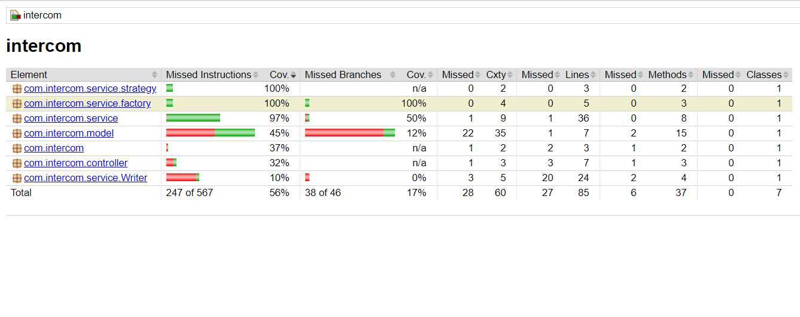

# Bin Range Application
The application checks the customer records and invites any customer within the provided radius of a given Intercom office. The program 
then outputs the customers in an output file in the root location:

1. Added Features
   1. Code Coverage Checkers
   2. REST Functionalities (GET)
   3. Unit Test & Integration Test

## Installation guide:

	A. Taken a Maven build:
		mvn clean install

	B. Go into the project root folder and run the below command in command Line:
        java -jar target/intercom-0.0.1-SNAPSHOT.jar

## Rest Endpoints

	1) Delete BinRange information by the below command
        curl -X GET --location "http://localhost:8080/customerInfo/distance/100/DUBLIN"

## Code Coverage Stats
    http://localhost:63342/intercom/target/site/jacoco/index.html#dn-c

