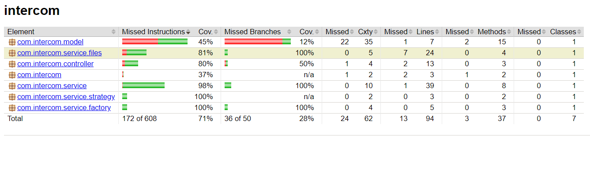

# Customer Range Application

The application checks the customer records and invites any customer within the provided radius of a given Intercom
office. The program then outputs the customers in an output file in the root location:

1. Added Features
    1. Code Coverage Checkers
    2. REST Functionalities (GET)
    3. Unit Test & Integration Test

## Installation guide:

	A. To get the application built, run the below command on Git bash:
		mvn clean install

	B. Go into the project root folder and run the below command in command Line to start the server:
        java -jar target/intercom-0.0.1-SNAPSHOT.jar

## You can execute tests in the command prompt by specifying the goal test when running Maven, for example:
      mvn test
      mvn clean test
      mvn clean compile test

## Rest Endpoints

	1. Gets the customer ids and names within the provided Radius from an Intercom Office.
       Currently only the GPS co-ordinates of the Dublin office is configured.
       REST URL: http://localhost:8080/customerInfo/distance/{radius}/{location}
       
         curl -X GET --location "http://localhost:8080/customerInfo/distance/100/DUBLIN"

## Code Coverage Stats

Once the server is started
http://localhost:63342/intercom/target/site/jacoco/index.html#dn-c

